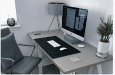
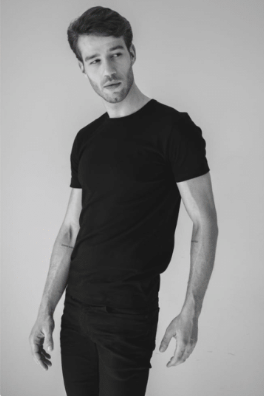

# UX Designer Portfolio

Welcome to the **UX Designer Portfolio** project! This project showcases the portfolio of a UX designer, highlighting their skills, biography, and successful work. The portfolio is built using **HTML** and **CSS**.

## Overview

This portfolio is designed to present the work and skills of a UX designer in a visually appealing and user-friendly manner. It includes sections for biography, skills, services offered, and a gallery of successful projects.

## Features

- **Responsive Design**: The portfolio is fully responsive and adapts to different screen sizes.
- **Dark Mode Toggle**: Users can switch between light and dark modes.
- **Interactive Navigation**: Easy-to-use navigation bar for quick access to different sections.
- **Skills Showcase**: Visual representation of skills with progress bars.
- **Gallery**: A collection of images showcasing successful projects.

## Technologies Used

- **HTML5**: For structuring the content.
- **CSS3**: For styling and layout.
- **Font Awesome**: For icons.

## Setup

1. Clone the repository or download the project files.
2. Open `index.html` in your preferred web browser.

## Screenshots

### Homepage

### Biography Section

### Skills Section

### Gallery

## Contact

For any inquiries or collaborations, feel free to reach out:

- **Name**: John Watson
- **Email**: example@mail.com
- **Phone**: +21 234 567 8901
- **Location**: London, UK

Follow me on:
- [LinkedIn](#)
- [Instagram](#)
- [Facebook](#)
- [Twitter](#)